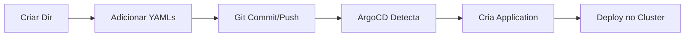

# Guia de Aplicações - Plain Manifests

Este documento descreve como gerenciar aplicações usando manifestos YAML diretos (sem Helm) no GitOps.

## 📋 Índice

1. [Visão Geral](#visão-geral)
2. [Estrutura de Diretórios](#estrutura-de-diretórios)
3. [Como Adicionar Nova Aplicação](#como-adicionar-nova-aplicação)
4. [ApplicationSet](#applicationset)
5. [Boas Práticas](#boas-práticas)
6. [Exemplos](#exemplos)

---

## 🎯 Visão Geral

### Princípio

Cada aplicação é um **diretório** dentro de `applications/` contendo manifestos Kubernetes YAML puros. O ApplicationSet descobre automaticamente novos diretórios e cria Applications no ArgoCD.

### Fluxo Automático



---

## 📁 Estrutura de Diretórios

```
applications/
├── game-2048/                    # Nome da aplicação
│   ├── 01-namespace.yaml         # Namespace (opcional)
│   ├── 02-deployment.yaml        # Deployment
│   ├── 03-service.yaml           # Service
│   └── 04-ingress.yaml           # Ingress (opcional)
├── inflate/
│   ├── 01-namespace.yaml
│   └── 02-deployment.yaml
└── {nova-app}/
    ├── 01-namespace.yaml
    ├── 02-deployment.yaml
    └── ...
```

### Convenções de Nomenclatura

1. **Diretório**: Nome da aplicação em kebab-case (ex: `my-app`, `user-service`)
2. **Arquivos**: Prefixo numérico para ordem de aplicação
   - `01-`: Namespace
   - `02-`: Deployment/StatefulSet
   - `03-`: Service
   - `04-`: Ingress/Route
   - `05-`: ConfigMap/Secret
   - `06-`: HPA/PDB
   - etc.

---

## 🚀 Como Adicionar Nova Aplicação

### Passo 1: Criar Diretório

```bash
cd gitops-cluster-management
mkdir -p applications/{app-name}
```

### Passo 2: Criar Manifests

#### Exemplo Mínimo (Namespace + Deployment)

```bash
# 01-namespace.yaml
cat > applications/{app-name}/01-namespace.yaml <<EOF
apiVersion: v1
kind: Namespace
metadata:
  name: {app-name}
  labels:
    app: {app-name}
    managed-by: gitops
EOF

# 02-deployment.yaml
cat > applications/{app-name}/02-deployment.yaml <<EOF
apiVersion: apps/v1
kind: Deployment
metadata:
  name: {app-name}
  namespace: {app-name}
  labels:
    app: {app-name}
spec:
  replicas: 2
  selector:
    matchLabels:
      app: {app-name}
  template:
    metadata:
      labels:
        app: {app-name}
    spec:
      containers:
        - name: {app-name}
          image: {your-image}:{tag}
          ports:
            - containerPort: 8080
          resources:
            requests:
              cpu: 100m
              memory: 128Mi
            limits:
              cpu: 500m
              memory: 512Mi
EOF
```

#### Exemplo Completo (+ Service + Ingress)

```bash
# 03-service.yaml
cat > applications/{app-name}/03-service.yaml <<EOF
apiVersion: v1
kind: Service
metadata:
  name: {app-name}
  namespace: {app-name}
spec:
  type: ClusterIP
  ports:
    - port: 80
      targetPort: 8080
      protocol: TCP
  selector:
    app: {app-name}
EOF

# 04-ingress.yaml
cat > applications/{app-name}/04-ingress.yaml <<EOF
apiVersion: networking.k8s.io/v1
kind: Ingress
metadata:
  name: {app-name}
  namespace: {app-name}
  annotations:
    alb.ingress.kubernetes.io/scheme: internet-facing
    alb.ingress.kubernetes.io/target-type: ip
    alb.ingress.kubernetes.io/load-balancer-name: {app-name}-alb
spec:
  ingressClassName: alb
  rules:
    - host: {app-name}.example.com
      http:
        paths:
          - path: /
            pathType: Prefix
            backend:
              service:
                name: {app-name}
                port:
                  number: 80
EOF
```

### Passo 3: Commit e Push

```bash
git add applications/{app-name}/
git commit -m "feat(app): add {app-name} application"
git push origin main
```

### Passo 4: Verificar Deploy (Automático)

```bash
# Aguardar ArgoCD detectar (1-3 minutos)
# Verificar ApplicationSet
kubectl get appset -n argocd appset-applications

# Verificar Application criada
kubectl get app -n argocd app-{app-name}

# Ver status
argocd app get app-{app-name}

# Ver recursos deployados
kubectl get all -n {app-name}
```

---

## 🔧 ApplicationSet

### Configuração Atual

```yaml
apiVersion: argoproj.io/v1alpha1
kind: ApplicationSet
metadata:
  name: appset-applications
  namespace: argocd
spec:
  generators:
    - git:
        repoURL: https://github.com/pcnuness/gitops-cluster-management.git
        revision: main
        directories:
          - path: applications/*  # Descobre automaticamente
  template:
    metadata:
      name: "app-{{path.basename}}"  # app-game-2048, app-inflate
    spec:
      project: default
      source:
        repoURL: https://github.com/pcnuness/gitops-cluster-management.git
        targetRevision: main
        path: "{{path}}"  # applications/game-2048
      destination:
        server: https://kubernetes.default.svc
      syncPolicy:
        automated:
          prune: true      # Remove recursos deletados
          selfHeal: true   # Corrige drift automaticamente
```

### Como Funciona

1. **Git Directory Generator**: Varre `applications/*` e cria uma Application para cada diretório
2. **Template**: Define como cada Application será criada
3. **Path Variable**: `{{path}}` = caminho completo (ex: `applications/game-2048`)
4. **Basename Variable**: `{{path.basename}}` = nome do diretório (ex: `game-2048`)

---

## ✅ Boas Práticas

### 1. **Namespace por Aplicação**

```yaml
# Sempre crie um namespace dedicado
apiVersion: v1
kind: Namespace
metadata:
  name: {app-name}
  labels:
    app: {app-name}
    environment: production
```

### 2. **Labels Consistentes**

```yaml
metadata:
  labels:
    app: {app-name}
    version: v1.0.0
    managed-by: gitops
    team: platform
```

### 3. **Resource Limits**

```yaml
resources:
  requests:
    cpu: 100m
    memory: 128Mi
  limits:
    cpu: 500m
    memory: 512Mi
```

### 4. **Health Checks**

```yaml
livenessProbe:
  httpGet:
    path: /health
    port: 8080
  initialDelaySeconds: 30
  periodSeconds: 10
readinessProbe:
  httpGet:
    path: /ready
    port: 8080
  initialDelaySeconds: 5
  periodSeconds: 5
```

### 5. **Security Context**

```yaml
securityContext:
  runAsNonRoot: true
  runAsUser: 1000
  fsGroup: 1000
  capabilities:
    drop:
      - ALL
  readOnlyRootFilesystem: true
```

### 6. **Ordenação de Recursos**

Use prefixos numéricos para garantir ordem de aplicação:
- `01-` Namespace
- `02-` RBAC (ServiceAccount, Role, RoleBinding)
- `03-` ConfigMap/Secret
- `04-` PVC
- `05-` Deployment/StatefulSet
- `06-` Service
- `07-` Ingress
- `08-` HPA/PDB

---

## 📚 Exemplos

### Exemplo 1: Aplicação Simples (game-2048)

```
applications/game-2048/
├── 01-namespace.yaml      # Cria namespace
├── 02-deployment.yaml     # 5 replicas, image ECR
├── 03-service.yaml        # ClusterIP port 80
└── 04-ingress.yaml        # ALB internet-facing
```

**Características**:
- Stateless
- Imagem pública
- Exposto via ALB

### Exemplo 2: Worker (inflate)

```
applications/inflate/
├── 01-namespace.yaml      # Namespace workshop
└── 02-deployment.yaml     # 8 replicas, pause container
```

**Características**:
- Sem Service/Ingress
- Para testes de carga
- Apenas consume recursos

### Exemplo 3: Aplicação Completa (exemplo)

```
applications/user-service/
├── 01-namespace.yaml              # Namespace
├── 02-serviceaccount.yaml         # IRSA para AWS
├── 03-configmap.yaml              # Configurações
├── 04-secret.yaml                 # Credenciais (External Secret)
├── 05-deployment.yaml             # Deployment com probes
├── 06-service.yaml                # Service
├── 07-ingress.yaml                # Ingress com TLS
└── 08-hpa.yaml                    # HorizontalPodAutoscaler
```

---

## 🔄 Atualização de Aplicações

### Atualizar Imagem

```bash
# Editar deployment
vim applications/{app-name}/02-deployment.yaml
# Mudar image: para nova versão

git add .
git commit -m "chore({app-name}): update image to v1.2.0"
git push

# ArgoCD aplica automaticamente (selfHeal: true)
```

### Adicionar Recurso

```bash
# Criar novo manifest
cat > applications/{app-name}/05-configmap.yaml <<EOF
apiVersion: v1
kind: ConfigMap
metadata:
  name: {app-name}-config
  namespace: {app-name}
data:
  LOG_LEVEL: info
EOF

git add .
git commit -m "feat({app-name}): add configmap"
git push
```

### Remover Aplicação

```bash
# Deletar diretório
rm -rf applications/{app-name}

git add .
git commit -m "chore: remove {app-name} application"
git push

# ArgoCD remove Application e recursos (prune: true)
```

---

## 🛠️ Troubleshooting

### Application não foi criada

```bash
# Verificar ApplicationSet
kubectl describe appset -n argocd appset-applications

# Ver logs do applicationset-controller
kubectl logs -n argocd -l app.kubernetes.io/name=argocd-applicationset-controller

# Forçar refresh
kubectl annotate appset -n argocd appset-applications argocd.argoproj.io/refresh=true
```

### Recursos não sincronizam

```bash
# Ver status da Application
argocd app get app-{app-name}

# Ver diff
argocd app diff app-{app-name}

# Sync manual
argocd app sync app-{app-name}

# Hard refresh
argocd app get app-{app-name} --hard-refresh
```

### Namespace não é criado

- Confirme que `CreateNamespace=true` está em `syncOptions`
- Ou crie explicitamente com `01-namespace.yaml`

---

## 📊 Monitoramento

### Verificar Status de Todas as Apps

```bash
# Listar todas as applications
kubectl get app -n argocd | grep ^app-

# Ver status resumido
argocd app list -o wide | grep ^app-

# Ver apenas unhealthy
argocd app list --selector health_status=Degraded
```

### Dashboard

Acesse o ArgoCD UI:
```bash
kubectl port-forward -n argocd svc/argocd-server 8080:443
# Abrir https://localhost:8080
```

---

## 🔗 Integração com CI/CD

### GitHub Actions (Exemplo)

```yaml
name: Update Application Image
on:
  push:
    tags:
      - 'v*'

jobs:
  update-manifest:
    runs-on: ubuntu-latest
    steps:
      - name: Checkout gitops repo
        uses: actions/checkout@v3
        with:
          repository: pcnuness/gitops-cluster-management
          
      - name: Update image tag
        run: |
          yq eval -i '.spec.template.spec.containers[0].image = "myapp:${{ github.ref_name }}"' \
            applications/my-app/02-deployment.yaml
            
      - name: Commit and push
        run: |
          git config user.name "GitHub Actions"
          git config user.email "actions@github.com"
          git add .
          git commit -m "chore(my-app): update to ${{ github.ref_name }}"
          git push
```

---

## 📝 Checklist para Nova Aplicação

- [ ] Diretório criado em `applications/{app-name}`
- [ ] Namespace definido (ou usa existente)
- [ ] Deployment com:
  - [ ] Labels consistentes
  - [ ] Resource limits
  - [ ] Health probes
  - [ ] Security context
- [ ] Service criado (se necessário)
- [ ] Ingress configurado (se exposto)
- [ ] Documentação atualizada
- [ ] Commit com mensagem descritiva
- [ ] Validado em cluster de dev

---

## 📚 Referências

- [ArgoCD ApplicationSet](https://argo-cd.readthedocs.io/en/stable/user-guide/application-set/)
- [Git Directory Generator](https://argo-cd.readthedocs.io/en/stable/operator-manual/applicationset/Generators-Git/)
- [Kubernetes Best Practices](https://kubernetes.io/docs/concepts/configuration/overview/)
