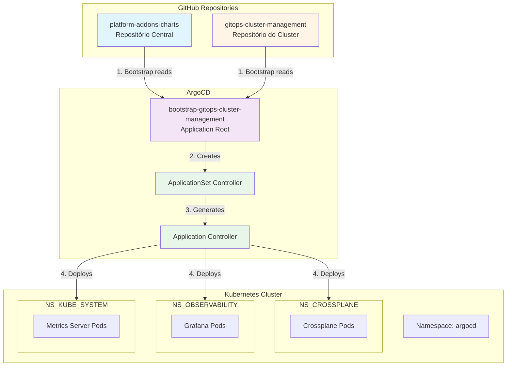
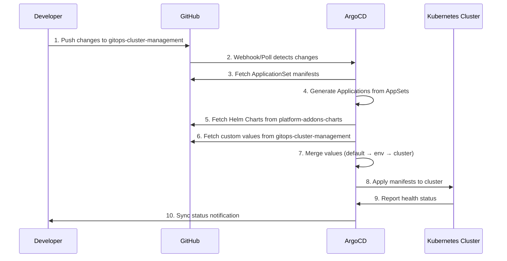
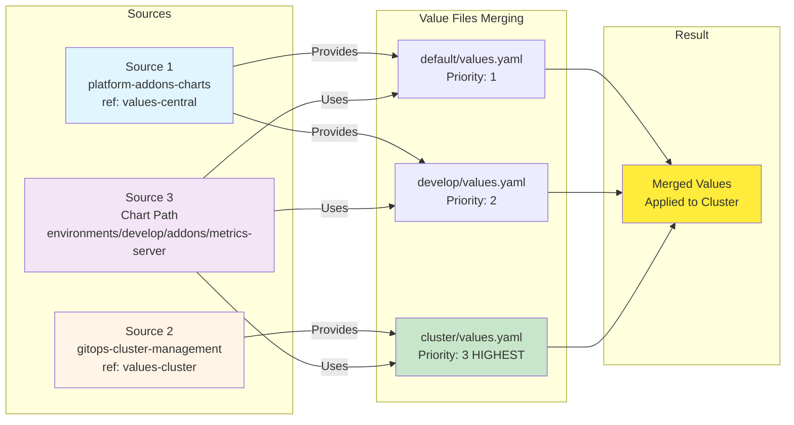
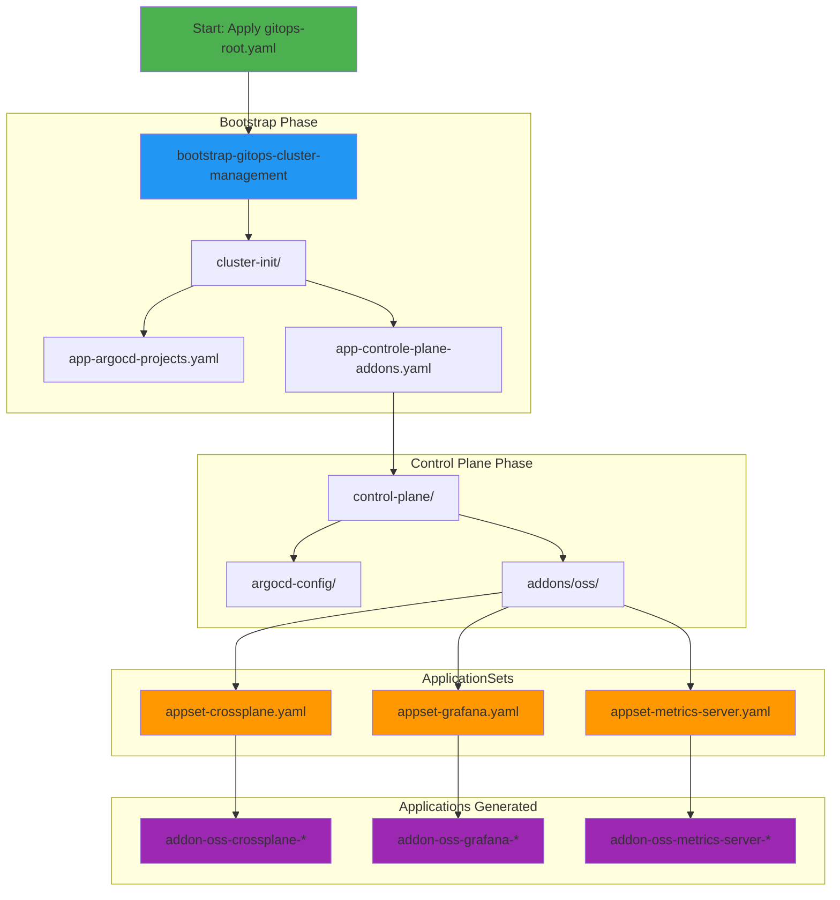
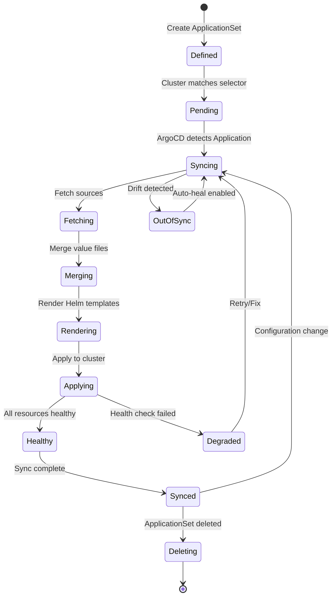
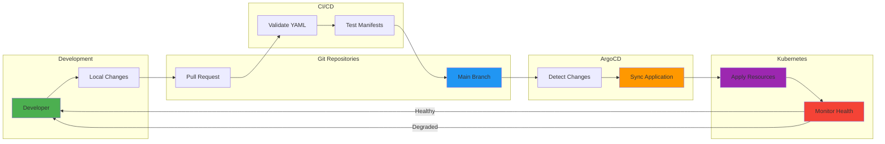

# Arquitetura GitOps - Cluster Management

Este documento apresenta a arquitetura completa do repositório `gitops-cluster-management` e sua integração com o repositório central `platform-addons-charts`.

## 📊 Visão Geral da Arquitetura



## 🏗️ Estrutura de Diretórios

```mermaid
graph LR
    subgraph "gitops-cluster-management"
        ROOT[/]
        
        subgraph "addons/"
            ADDONS_CROSS[crossplane/values.yaml]
            ADDONS_GRAF[grafana/values.yaml]
            ADDONS_METRICS[metrics-server/values.yaml]
        end
        
        subgraph "bootstraps/"
            BOOT_ROOT[gitops-root.yaml]
            
            subgraph "cluster-init/"
                INIT_PROJECTS[app-argocd-projects.yaml]
                INIT_ADDONS[app-controle-plane-addons.yaml]
            end
            
            subgraph "control-plane/"
                subgraph "argocd-config/"
                    PROJ[app-projects.yaml]
                end
                
                subgraph "addons/oss/"
                    APPSET_CROSS[appset-crossplane.yaml]
                    APPSET_GRAF[appset-grafana.yaml]
                    APPSET_METRICS[appset-metrics-server.yaml]
                end
            end
        end
        
        subgraph "iac/"
            IAC_S3[s3-bucket/]
            IAC_SECRETS[secrets-manager/]
        end
    end
    
    ROOT --> addons/
    ROOT --> bootstraps/
    ROOT --> iac/
    
    style ROOT fill:#f9f9f9
    style addons/ fill:#fff4e6
    style bootstraps/ fill:#e1f5ff
    style iac/ fill:#f3e5f5
```

## 🔄 Fluxo de Deployment



## 📦 ApplicationSet Generator Pattern

```mermaid
graph TB
    subgraph "ApplicationSet Generator"
        APPSET[ApplicationSet<br/>addons-oss-metrics-server]
        
        subgraph "Generator: Clusters"
            SELECTOR[Selector<br/>environment: develop]
            CLUSTER1[Cluster: data-plataform-dev-eks<br/>label: environment=develop]
        end
        
        subgraph "Template"
            TEMPLATE[Template<br/>addon-oss-metrics-server-{{name}}]
        end
    end
    
    subgraph "Generated Applications"
        APP1[Application<br/>addon-oss-metrics-server-data-plataform-dev-eks]
    end
    
    APPSET -->|Reads| SELECTOR
    SELECTOR -->|Matches| CLUSTER1
    CLUSTER1 -->|Generates| TEMPLATE
    TEMPLATE -->|Creates| APP1
    
    style APPSET fill:#e8f5e9
    style SELECTOR fill:#fff3e0
    style CLUSTER1 fill:#e1f5ff
    style TEMPLATE fill:#f3e5f5
    style APP1 fill:#e8f5e9
```

## 🔗 Multi-Source Values Merging



## 🎯 Bootstrap Flow



## 🔐 Multi-Tenancy & Environment Isolation

```mermaid
graph TB
    subgraph "Clusters"
        CLUSTER_DEV[Cluster: develop<br/>label: environment=develop]
        CLUSTER_UAT[Cluster: uat<br/>label: environment=uat]
        CLUSTER_PROD[Cluster: prod<br/>label: environment=prod]
    end
    
    subgraph "ApplicationSets"
        APPSET[ApplicationSet<br/>Selector: environment In [develop,uat,prod]]
    end
    
    subgraph "Platform Addons Charts"
        ENV_DEV[environments/develop/addons/]
        ENV_UAT[environments/uat/addons/]
        ENV_PROD[environments/prod/addons/]
    end
    
    subgraph "Cluster Overrides"
        OVERRIDE[gitops-cluster-management<br/>addons/]
    end
    
    APPSET -->|Matches| CLUSTER_DEV
    APPSET -->|Matches| CLUSTER_UAT
    APPSET -->|Matches| CLUSTER_PROD
    
    CLUSTER_DEV -->|Uses| ENV_DEV
    CLUSTER_UAT -->|Uses| ENV_UAT
    CLUSTER_PROD -->|Uses| ENV_PROD
    
    CLUSTER_DEV -->|Overrides| OVERRIDE
    CLUSTER_UAT -->|Overrides| OVERRIDE
    CLUSTER_PROD -->|Overrides| OVERRIDE
    
    style CLUSTER_DEV fill:#81c784
    style CLUSTER_UAT fill:#ffb74d
    style CLUSTER_PROD fill:#e57373
    style APPSET fill:#64b5f6
    style OVERRIDE fill:#fff176
```

## 📊 Addon Lifecycle



## 🔄 GitOps Workflow



## 🎯 Componentes Principais

### 1. **Bootstrap Layer**
- **gitops-root.yaml**: Application raiz que inicializa todo o cluster
- **cluster-init/**: Configurações iniciais (projetos ArgoCD, addons base)

### 2. **Control Plane Layer**
- **argocd-config/**: Configurações do ArgoCD (projetos, RBAC)
- **addons/oss/**: ApplicationSets para addons open source

### 3. **Addons Layer**
- **addons/**: Valores customizados específicos do cluster
- Sobrescreve valores do repositório central

### 4. **IaC Layer**
- **iac/**: Recursos de infraestrutura (S3, Secrets Manager)
- Gerenciados via Crossplane

## 🔑 Conceitos Chave

### Multi-Source Strategy
- **Source 1**: Repositório central (valores default e por ambiente)
- **Source 2**: Repositório do cluster (valores customizados)
- **Source 3**: Chart Helm (templates e manifests)

### Value Precedence
1. Default values (menor precedência)
2. Environment values
3. Cluster overrides (maior precedência)

### Cluster Selection
- ApplicationSets usam `selector.matchExpressions`
- Clusters devem ter label `environment`
- Valores: `develop`, `uat`, `prod`

## 📝 Referências

- [ArgoCD ApplicationSets](https://argo-cd.readthedocs.io/en/stable/user-guide/application-set/)
- [Helm Multi-Source](https://argo-cd.readthedocs.io/en/stable/user-guide/multiple_sources/)
- [GitOps Principles](https://opengitops.dev/)
