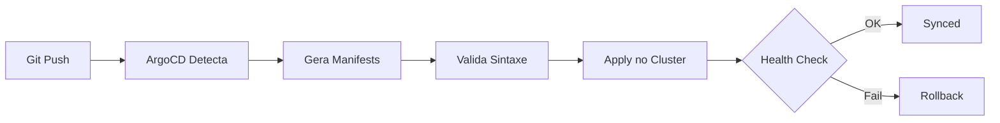

# GitOps Cluster Management

Este repositório gerencia os addons essenciais para clusters Kubernetes usando GitOps com ArgoCD. A estrutura foi projetada para suportar crescimento de forma escalável e organizacional.

## 📋 Índice

1. [Estrutura do Repositório](#estrutura-do-repositório)
2. [Princípios de Design](#princípios-de-design)
3. [Addons Suportados](#addons-suportados)
4. [Como Usar](#como-usar)
5. [Versionamento e Rollout](#versionamento-e-rollout)
6. [Documentação Adicional](#documentação-adicional)

---

## 📁 Estrutura do Repositório

```
gitops-cluster-management/
├── addons/                       # Valores customizados por cluster
│   ├── metrics-server/
│   │   └── values.yaml          # Overrides específicos do cluster
│   ├── grafana/
│   │   └── values.yaml
│   └── crossplane/
│       └── values.yaml
├── bootstraps/                   # ApplicationSets e configurações do ArgoCD
│   ├── cluster-init/             # Bootstrap inicial do cluster
│   │   ├── app-argocd-projects.yaml
│   │   └── app-controle-plane-addons.yaml
│   └── control-plane/            # Gerenciamento dos addons
│       └── addons/
│           └── oss/              # ApplicationSets para addons OSS
│               ├── appset-metrics-server.yaml
│               ├── appset-grafana.yaml
│               └── appset-crossplane.yaml
├── docs/                         # Documentação
│   ├── SOURCES_STRUCTURE.md     # Estrutura de sources multi-repo
│   ├── ROLLOUT_STRATEGIES.md    # Estratégias de rollout e versionamento
│   └── ARCHITECTURE.md           # Diagrama de arquitetura
└── README.md                     # Esta documentação
```

---

## 🎯 Princípios de Design

### 1. **Separação de Responsabilidades**

#### Repositório Central (`platform-addons-charts`)
- Contém Charts base com valores padrão
- Versionamento centralizado
- Um único Chart por addon
- Usado por todos os clusters

#### Repositório por Cluster (`gitops-cluster-management`)
- Contém apenas customizações específicas
- Valores que sobrescrevem os padrões
- Configurações sensíveis ao ambiente
- Um repositório por cluster/ambiente

### 2. **Precedência de Valores**

Os valores são mesclados na seguinte ordem (último sobrescreve):

1. **Valores Base** (`platform-addons-charts/addons/{addon}/values.yaml`)
   - Valores padrão aplicáveis a todos os ambientes
   
2. **Valores Customizados** (`gitops-cluster-management/addons/{addon}/values.yaml`)
   - Overrides específicos do cluster
   - Configurações sensíveis (senhas, endpoints)

### 3. **Versionamento Controlado**

```yaml
# ApplicationSet
sources:
  - repoURL: 'https://github.com/pcnuness/platform-addons-charts.git'
    targetRevision: 'main'      # Develop: usa 'main' (bleeding edge)
    # targetRevision: 'v0.1.0'  # UAT/Prod: usa tags (stable)
```

---

## 📦 Addons Suportados

### Metrics & Monitoring
| Addon | Versão | Descrição | Namespace |
|-------|--------|-----------|-----------|
| **metrics-server** | 3.12.2 | Coleta métricas de recursos do cluster | `kube-system` |
| **grafana** | 10.0.0 | Plataforma de observabilidade e dashboards | `observability` |

### Infrastructure as Code
| Addon | Versão | Descrição | Namespace |
|-------|--------|-----------|-----------|
| **crossplane** | 1.15.3 | Provisionamento de recursos AWS | `crossplane-system` |

---

## 🚀 Como Usar

### 1. Adicionar um Novo Addon

#### Passo 1: Adicionar Chart no Repositório Central

```bash
# No repositório platform-addons-charts
cd platform-addons-charts
mkdir -p addons/{addon-name}

# Criar Chart.yaml
cat > addons/{addon-name}/Chart.yaml <<EOF
apiVersion: v2
name: {addon-name}
description: A helm chart for {addon-name}
type: application
version: 0.1.0
appVersion: "1.0.0"
dependencies:
  - name: {addon-name}
    version: 1.0.0
    repository: https://charts.example.com/
EOF

# Criar values.yaml base
cat > addons/{addon-name}/values.yaml <<EOF
{addon-name}:
  fullnameOverride: {addon-name}
  # Valores padrão aqui
EOF

git add .
git commit -m "feat(addon): add {addon-name} chart"
git push
```

#### Passo 2: Criar ApplicationSet

```bash
# No repositório gitops-cluster-management
cd gitops-cluster-management
cat > bootstraps/control-plane/addons/oss/appset-{addon-name}.yaml <<EOF
apiVersion: argoproj.io/v1alpha1
kind: ApplicationSet
metadata:
  name: addons-oss-{addon-name}
  namespace: argocd
spec:
  generators:
    - clusters:
        values:
          addonChart: {addon-name}
          addonChartNamespace: {namespace}
        selector:
          matchExpressions:
            - key: environment
              operator: In
              values: ["develop", "uat", "prod"]
  template:
    metadata:
      name: addon-oss-{{values.addonChart}}-{{name}}
    spec:
      project: cluster-management
      sources:
        - repoURL: 'https://github.com/pcnuness/platform-addons-charts.git'
          targetRevision: 'main'
          ref: values-central
        - repoURL: 'https://github.com/pcnuness/gitops-cluster-management.git'
          targetRevision: 'main'
          ref: values-cluster
        - repoURL: 'https://github.com/pcnuness/platform-addons-charts.git'
          targetRevision: 'main'
          path: addons/{{values.addonChart}}
          helm:
            valueFiles:
              - \$values-central/addons/{{values.addonChart}}/values.yaml
              - \$values-cluster/addons/{{values.addonChart}}/values.yaml
            ignoreMissingValueFiles: true
      destination:
        namespace: '{{values.addonChartNamespace}}'
        name: '{{name}}'
      syncPolicy:
        automated:
          prune: true
          selfHeal: true
        syncOptions:
          - CreateNamespace=true
EOF

git add .
git commit -m "feat(addon): add {addon-name} ApplicationSet"
git push
```

#### Passo 3: Adicionar Customizações (Opcional)

```bash
# Criar valores customizados para o cluster
mkdir -p addons/{addon-name}
cat > addons/{addon-name}/values.yaml <<EOF
{addon-name}:
  # Overrides específicos do cluster
  replicas: 3
  resources:
    limits:
      cpu: 500m
      memory: 512Mi
EOF

git add .
git commit -m "feat(addon): add {addon-name} custom values"
git push
```

### 2. Atualizar Versão de um Addon

Ver documentação completa em [ROLLOUT_STRATEGIES.md](./ROLLOUT_STRATEGIES.md)

**Resumo**:
```bash
# 1. Atualizar Chart no platform-addons-charts
cd platform-addons-charts/addons/{addon}
# Editar Chart.yaml (version, appVersion, dependencies)
git commit -m "feat({addon}): upgrade to v{new-version}"
git tag -a v0.2.0 -m "Release v0.2.0"
git push --tags

# 2. Deploy automático em develop (usa 'main')
# 3. Promover para UAT/Prod (atualizar targetRevision para 'v0.2.0')
```

---

## 🔄 Versionamento e Rollout

### Estratégias Disponíveis

1. **Rolling Update** (Padrão)
   - Zero downtime
   - Atualização gradual de pods
   - Ideal para atualizações normais

2. **Blue-Green Deployment**
   - Duas versões completas rodando
   - Switch instantâneo
   - Ideal para atualizações críticas

3. **Canary Deployment**
   - Rollout gradual (10% → 25% → 50% → 100%)
   - Detecção precoce de problemas
   - Ideal para atualizações de alto risco

Ver detalhes completos em [ROLLOUT_STRATEGIES.md](./ROLLOUT_STRATEGIES.md)

### Controle de Versão por Ambiente

```yaml
# Develop: sempre usa 'main' (bleeding edge)
targetRevision: 'main'

# UAT: usa versão específica testada
targetRevision: 'v0.1.0'

# Prod: usa versão validada em UAT
targetRevision: 'v0.1.0'
```

---

## 📚 Documentação Adicional

| Documento | Descrição |
|-----------|-----------|
| [SOURCES_STRUCTURE.md](./SOURCES_STRUCTURE.md) | Estrutura detalhada de sources multi-repositório |
| [ROLLOUT_STRATEGIES.md](./ROLLOUT_STRATEGIES.md) | Estratégias completas de rollout e versionamento |
| [ARCHITECTURE.md](./ARCHITECTURE.md) | Diagrama de arquitetura Mermaid |
| [CLUSTER_CONFIGURATION.md](./CLUSTER_CONFIGURATION.md) | Como configurar clusters com labels |

---

## 🔐 Segurança

### IAM Roles
- Cada cluster deve ter IAM roles configuradas para Crossplane
- Políticas mínimas necessárias (least privilege)
- Rotação de credenciais automatizada

### Secrets Management
- Secrets armazenados em AWS Secrets Manager
- Integração com External Secrets Operator
- Nunca commitar secrets no Git

---

## 📊 Monitoramento

### Métricas
- ServiceMonitors para Prometheus
- Dashboards pré-configurados no Grafana
- Alertas configurados via PrometheusRules

### Logs
- Logs estruturados em JSON
- Integração com CloudWatch (opcional)
- Rotação de logs configurada

### Health Checks
- ArgoCD health checks automáticos
- Rollback automático em caso de falha
- Notificações via Slack/Email

---

## 🚀 CI/CD Integration

### Fluxo de Deploy



1. **Push** para branch principal
2. **ArgoCD** detecta mudanças automaticamente
3. **Sync** automático com validação
4. **Health checks** e rollback automático

---

## 🛠️ Troubleshooting

### Addon não está sincronizando

```bash
# Verificar status do ApplicationSet
kubectl get appset -n argocd

# Verificar Applications geradas
kubectl get app -n argocd | grep addon-oss

# Forçar refresh
argocd app get <app-name> --refresh
```

### Valores customizados não estão sendo aplicados

1. Verificar ordem dos `valueFiles` no ApplicationSet
2. Confirmar que `ignoreMissingValueFiles: true` está presente
3. Verificar logs do ArgoCD repo-server:
   ```bash
   kubectl logs -n argocd -l app.kubernetes.io/name=argocd-repo-server
   ```

### Chart.yaml não encontrado

- Confirmar que o `path` no source aponta para o diretório correto
- Verificar que `Chart.yaml` existe (não `Charts.yaml`)
- Limpar cache do ArgoCD:
   ```bash
   kubectl delete pod -n argocd -l app.kubernetes.io/name=argocd-repo-server
   ```

---

## 🤝 Contribuindo

1. Crie uma branch de feature
2. Faça suas alterações
3. Teste em ambiente de develop
4. Crie um Pull Request
5. Aguarde revisão e aprovação

---

## 📝 Licença

Este projeto é de uso interno.

---

**Nota**: Esta estrutura foi projetada para ser escalável, segura e de fácil manutenção.
